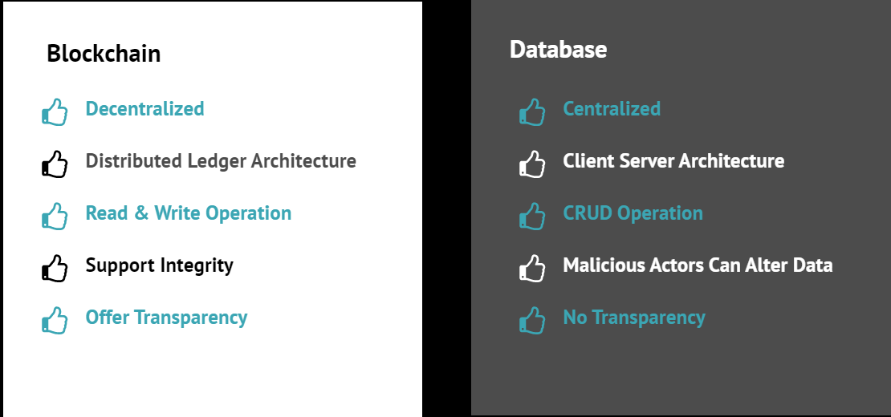

Advantages of using Blockchain
##############################
* Traditionally, a record of all transactions is kept in a central location (such as a bank for financial transactions). Blockchain, however, records them in a distributed ledger. It links transactions (blocks) in an encrypted ledger (chain), stored on many computers in a peer-to-peer network. The larger the network, the more difficult to corrupt.
* Blockchain is a system of recording information in a way that makes it difficult or impossible to change, hack, or cheat the system.
  
