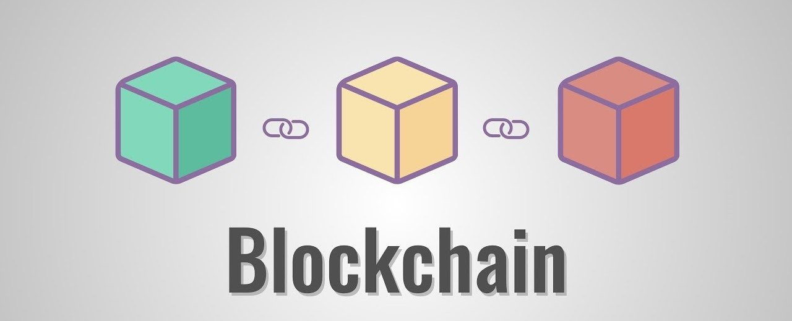
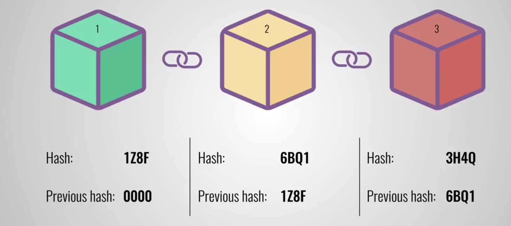
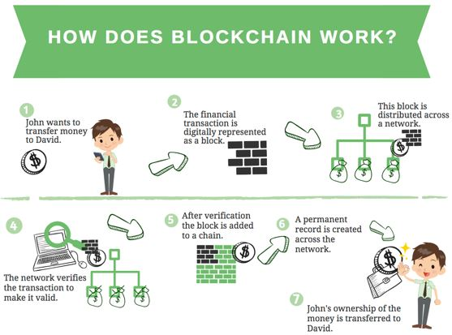

What is Blockchain
##################

Basics
***********

A blockchain is essentially a digital ledger of transactions that is duplicated and distributed across the entire network of computer systems on the blockchain. Each block in the chain contains a number of transactions, and every time a new transaction occurs on the blockchain, a record of that transaction is added to every participant’s ledger. The decentralised database managed by multiple participants is known as Distributed Ledger Technology (DLT).

Blockchain is a type of DLT in which transactions are recorded with an immutable cryptographic signature called a hash.

.. image:: ../_static/images/blockchain1.png
  :alt: The Properties of Distributed Ledger Technology (DLT) | Blockchain Explained

This means if one block in one chain was changed, it would be immediately apparent it had been tampered with. If hackers wanted to corrupt a blockchain system, they would have to change every block in the chain, across all of the distributed versions of the chain.

Blockchains such as Bitcoin and Ethereum are constantly and continually growing as blocks are being added to the chain, which significantly adds to the security of the ledger.

Blocks in Blockchain
********************
Structure of a block

* Block number
* Nounce
* Data
* Previous Hash
* Current Hash
  

`Blockchain Demo <https://andersbrownworth.com/blockchain/blockchain>`_

How Blockchain works
*********************
The easiest way to explain blockchain technology is through a fictional financial transaction. In the example below, John wants to send money to David using blockchain technology.

Resources
*************
* https://www.euromoney.com/learning/blockchain-explained/what-is-blockchain
* https://www.youtube.com/watch?v=SSo_EIwHSd4
* https://www.cbi.eu/market-information/outsourcing-itobpo/blockchain