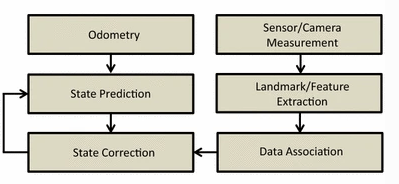

How SLAM Works ?
##################

Sensor Data Alignment
***********************

Computers see a robot’s position as simply a timestamp dot on a map or timeline.

Robots continuously do split-second gathering of sensor data on their surroundings. Camera images are taken as many as 90 times a second for depth-image measurements. And LiDAR images, used for precise range measurements, are taken 20 times a second.

When a robot moves, these data points help measure how far it’s gone relative to its previous location and where it is located on a map.

Motion Estimation
*******************

Wheel odometry takes into account the rotation of a robot’s wheels to help measure how far it’s travelled. Inertial measurement units are also used to gauge speed and acceleration as a way to track a robot’s position.

All of these sensor streams are taken into consideration in what’s known as sensor fusion to get a better estimate of how a robot is moving.

Kalman filter algorithms and particle filter algorithms — basically, a bunch of sophisticated math — that rely on sequential Monte Carlo methods can be used to fuse these sensor inputs.

The method of odometry measurement is not accurate as it does not account for wheel slippage.

Map Building
*************

Maps are sparse point clouds of features that can be used mostly for localization.

Taking measurements based on every single pixel in its field of view, the robot can build a dense map of its surroundings.

This is called dense scene mapping and it provides the shape, size, colour and texture of the objects in its space.

This enables much more accurate obstacle detection, avoidance, and the ability to plan movements in advance.

Occupancy Grid
****************
As a robot perceives its surroundings using LiDAR or cameras, it creates an occupancy grid map of the robot’s environment with the resolution determined by the user. 

This 2D “local map” provides information, whether each cell in the map is blocked or free, so that the robot can plan its navigation path accordingly.

Algorithms
************

Statistical techniques used to approximate the above equations include Kalman filters and particle filters (aka. Monte Carlo methods). They provide an estimation of the posterior probability function for the pose of the robot and for the parameters of the map.

Various SLAM algorithms are implemented in the robot operating system (ROS) libraries, often used together with the Point Cloud Library.

Block Diagram
---------------

If we see the above block diagram, it explains how the SLAM Algorithm works altogether. It shows the main components of a Visual Odometry and filter based SLAM system. Odometry and the Camera/ Sensor data feed is taken by the robot. This data is then processed to estimate the State of Robot and also extract the Landmark.

These data is then passed to the State Correction which works with the State Predition to effectively estimate the location of the robot.

.. admonition:: Resources

  * https://en.wikipedia.org/wiki/Simultaneous_localization_and_mapping
  * https://www.mathworks.com/discovery/slam.html
  * https://blogs.nvidia.com/blog/2019/07/25/what-is-simultaneous-localization-and-mapping-nvidia-jetson-isaac-sdk/
  * https://geoslam.com/what-is-slam/