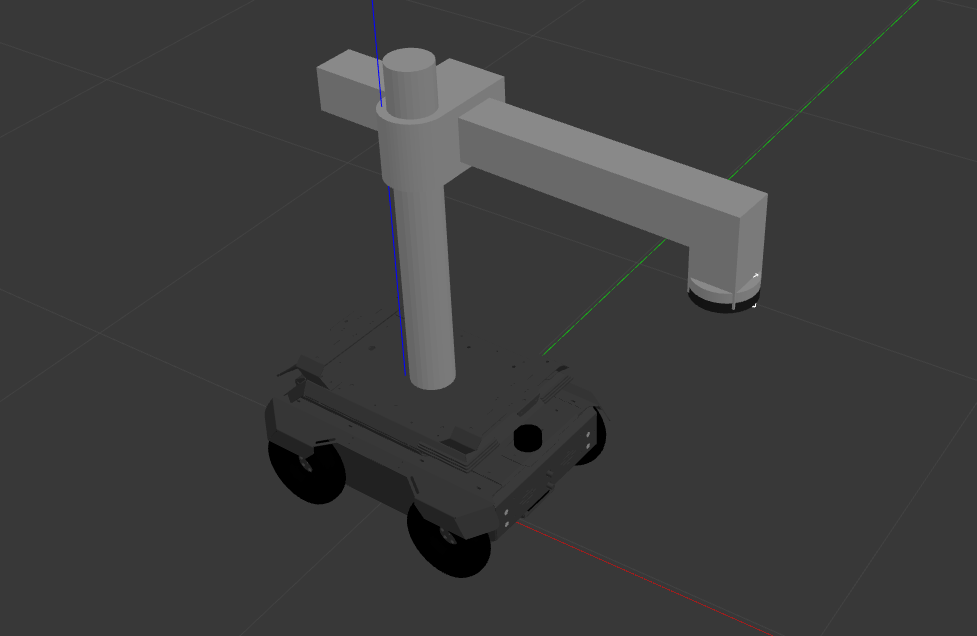
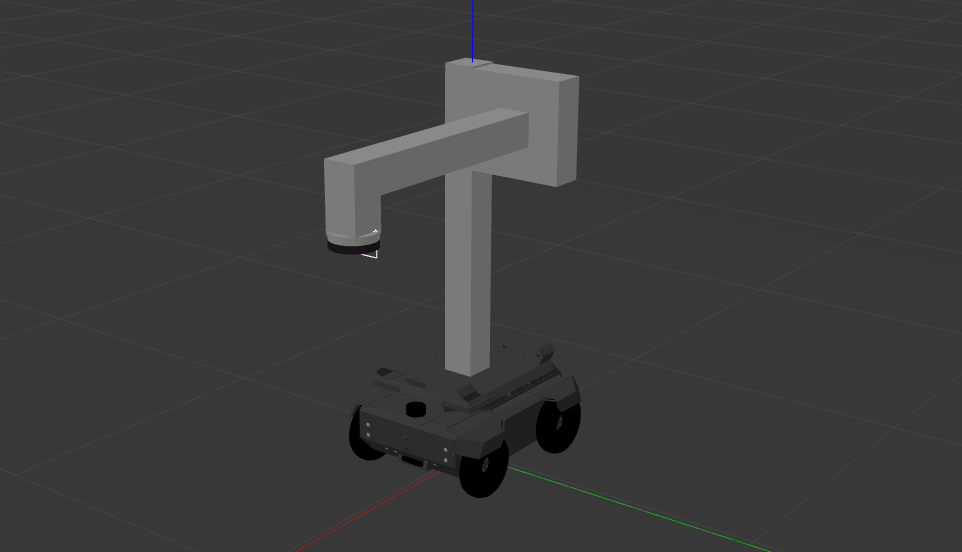

Simple 2-DoF Arm Using Gazebo Modelling
#######################################

Due to the system limitations, we also tried designing a simple 2 Degree of freedom arm to avoid using MoveIt.
We used tried couple different methods,

Desiging the arm in Fusion 360 and using fusion2urdf plugin
------------------------------------------------------------

This arm design was first made in Autodesk Fusion 360 and then it was converted using the ``fusion2urdf`` plugin. 
This plugin is used to convert our Fusion 360 design files of the robot into URDF which we can use in ROS (Robot Operating System) based simulation on Gazebo Simulator

.. seealso::

    More information regarding the fusion2urdf plugin can be found in `fusion2urdf Tutorial <https://www.youtube.com/watch?v=TitHYg-5_j8>`_

Using primitive shapes in Gazebo Modelling
--------------------------------------------

The above image shows the arm which is made by using only the primitive shapes available in Gazebo. 

Controlling the Arm
---------------------

We needed to write and initiate controllers for the arm and publish to a topic for movement of the joints.

The most simplest way to control the movement of the arm is by ``rostopic pub`` which directly publishes the movement data of the vertical movement on the arm topic ``/ebot_1/move_joint_1_position_controller/command``. The joint limit ranges from ``-0.4 to 0.25``. For example:

.. code-block:: bash

    rostopic pub /ebot_1/move_joint_1_position_controller/command std_msgs/Float64 "data: 0.25"

Similarly, for the horizontal arm movement we publish the data to the topic ``/ebot_1/move_joint_2_position_controller/command``. The joint limit ranges from ``-0.4 to 0.1``. For example:

.. code-block:: bash

    rostopic pub /ebot_1/move_joint_2_position_controller/command std_msgs/Float64 "data: 0.1"

In the same way, for controlling this arm movement, we can publish the data to the topics ``/ebot_1/move_joint_1_position_controller/command`` and ``/ebot_1/move_joint_2_position_controller/command`` using rospy.
