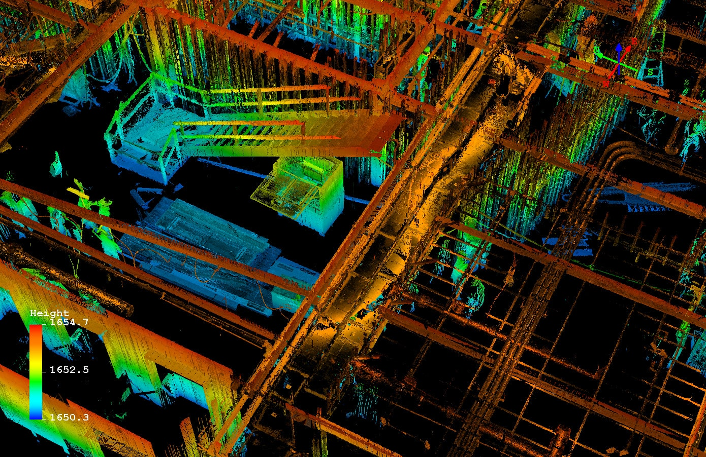

Benefits of SLAM
######################

SLAM based systems are inherently mobile – they are at their best when used on the move. With a SLAM mobile mapping system, it’s possible to simply walk through an environment building a digital map on the go, saving time and money by removing laborious set-ups from the equation. 
SLAM based mobile mapping systems slash survey times and can be over 10 times faster at acquiring data.

Additionally, GPS doesn’t work indoors; it requires a line of sight to at least three satellites to function, but it isn’t just indoors that is out of bounds to GPS based systems. 
Forests prove difficult, as tree canopies block the line of sight to the sky and urban canyons or tall buildings block signals in built up environments too. 

SLAM based technology overcomes these obstacles by cutting out GPS altogether.

