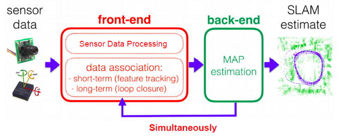

Types of SLAM
################

Visual SLAM (vSLAM)
**********************

* Visual SLAM or vSLAM calculates the position and orientation of a device with respect to its surroundings while mapping the environment at the same time, using only visual inputs from a camera.   
* It can be implemented at a low cost with relatively inexpensive cameras.
* Cameras can be used to detect landmarks as well since they provide a large volume of information.
* Landmark detection can also be combined with graph-based optimization, achieving flexibility in SLAM implementation.

.. image:: ../_static/images/vslam.png
  :width: 500
  :alt: Visual SLAM Image

Components of vSLAM
**********************

* The architecture of a vSLAM system includes two main components: Front-end & Back-end
* The front-end abstracts sensor data into models for estimation, while the back-end performs inference on the abstracted data produced by the front-end.

LiDAR SLAM
***********

* Light detection and ranging or LiDAR is a method that primarily uses a laser sensor (or distance sensor).
* A LiDAR-based SLAM system generates a 3D map of its environment. LiDAR measures the distance to an object by illuminating the object using an active laser “pulse”.
* LiDAR is both a fast and accurate approach and can be used in a wide range of environments and conditions. 
* The output values from laser sensors are generally 2D (x, y) or 3D (x, y, z) point cloud data.
* Generally, movement is estimated sequentially by matching the point clouds. The calculated movement (travelled distance) is used for localizing the vehicle. 
