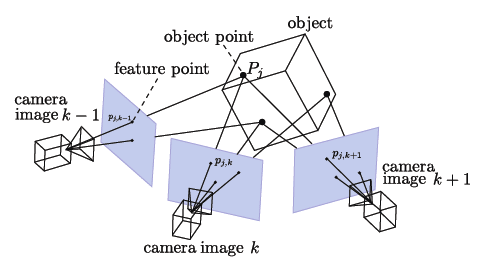
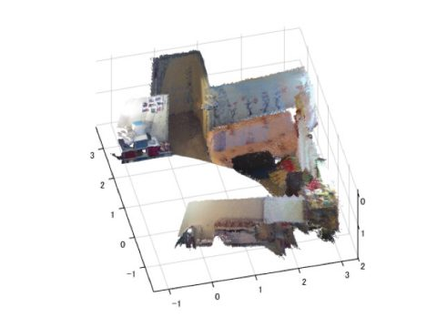
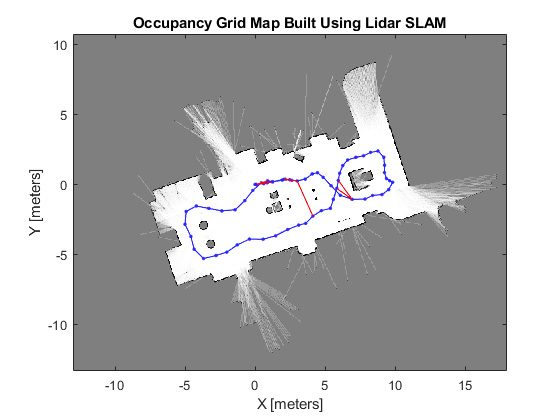
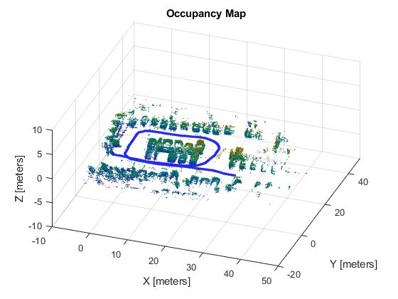

Types of SLAM
################

Visual SLAM (vSLAM)
**********************

Visual SLAM or vSLAM calculates the position and orientation of any robot with respect to its surroundings while mapping the environment at the same time, using only visual inputs from a camera.   

It can be implemented at a low cost with relatively inexpensive cameras. Visual SLAM can use simple cameras (wide angle, fish-eye, and spherical cameras), compound eye cameras (stereo and multi cameras), and RGB-D cameras (depth and ToF cameras).

Cameras can be used to detect landmarks as well since they provide a large volume of information. In addition, since cameras provide a large volume of information, they can be used to detect a landmarks (previously measured positions). Landmark detection can also be combined with graph-based optimization, achieving flexibility in SLAM implementation.

Monocular SLAM is when vSLAM uses a single camera as the only sensor, which makes it challenging to define depth. This can be solved by either detecting AR markers, checkerboards, or other known objects in the image for localization or by fusing the camera information with another sensor such as IMU, which can measure physical quantities such as velocity and orientation. 

vSLAM typically tracks points of interest through successive camera frames to triangulate the 3D position of the camera, this information is then used to build a 3D map.  

Above image is the Point Cloud Data of RGB-D SLAM. It allows to quickly acquire colored 3D models of objects and indoor scenes with a hand-held Kinect-style camera. It provides a SLAM front-end based on visual features such as SURF or SIFT to match pairs of acquired images, and uses RANSAC to robustly estimate the 3D transformation between them.

LiDAR SLAM
***********

Light detection and ranging or LiDAR is a method that uses a laser sensor or distance sensor.

A LiDAR-based SLAM system generates a 3D map of its environment. LiDAR measures the distance to an object by illuminating the object using an active laser “pulse”. LiDAR is both a fast and accurate approach and can be used in a wide range of environments and conditions. 

The output values from laser sensors are generally 2D (x, y) or 3D (x, y, z) point cloud data. The laser sensor point cloud provides high-precision distance measurements, and works very effectively for map construction with SLAM.

For lidar point cloud matching, iterative closest point (ICP) and normal distributions transform (NDT) algorithms are used. Generally, movement is estimated sequentially by matching the point clouds. The calculated movement (travelled distance) is used for localizing the vehicle. 

The point clouds are not as finely detailed as images in terms of density and do not always provide sufficient features for matching. In places where there are few obstacles, it is difficult to align the point clouds and this may result in losing track of the vehicle location. Point cloud matching generally requires high processing power, so it is necessary to optimize the processes to improve speed.

Due to these challenges, localization for autonomous vehicles may involve fusing other measurement results such as wheel odometry, global navigation satellite system (GNSS), and IMU data.

For applications such as warehouse robots, where only indoor navigation is required and has many many obstacles, 2D lidar SLAM is commonly used.

SLAM using 3-D lidar point clouds can be used for UAVs and automated parking as it requires more data regading the terrain and environment.