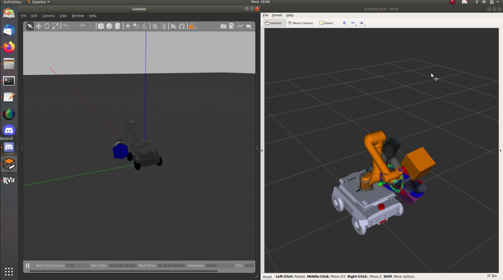

How Robot Model is made in ROS ?
##################################

In this section, lets look at how do we create and modify a robot model for ROS.

URDF
*****

The Unified Robotic Description Format (URDF) is an XML file format used in ROS to describe all elements of a robot. These files are used by a ROS to tell the simulator what the robot actually looks like in real life. URDF specifies the kinematics, dynamic properties and other metadata of the robot.
    
Limitations of URDF
--------------------

* Immutability of URDF once its loaded on param server
* Only Robot tree structure supported 
* No <sensor> tag
* No reusability

.. seealso::

    More information can be found in `ROS Wiki URDF <http://wiki.ros.org/urdf>`_

XACRO
*******

Xacro is like a template, just a Macro has to be created and Voila! You can add multiple objects with just the name and required params.

Why Xacro ?
------------

* Macro-ing
* Conditional statements
* Mathematical expressions
* Property assignment
* Include other xacro files

.. seealso::

    More information can be found in `ROS Wiki Xacro <http://wiki.ros.org/xacro>`_

How We Created 
****************

We started with the robot model provided by e-Yantra Team in eYRC Sahayak Bot Theme. The robot model had a UR5 arm mounted on it's top with a Robotiq 2F-85 gripper which is a mechanical gripper.
The mechanical gripper was replaced by a custom designed vaccum gripper for proper pickup and place of objects.

The following images shows the robot with the vaccum gripper moving with the package in it's arm.

